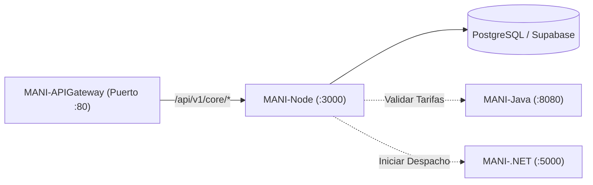

# MANI-Node — Servicio Core Backend de MANI

Servicio backend central y transaccional del ecosistema **MANI** (*TRAMA · Ingeniería de Software*), desarrollado en **Node.js y Express**.

Este repositorio es responsable del dominio operativo principal: gestión de usuarios, roles (Clientes, Aliados y Administradores), validación de documentación KYC, catálogo de servicios, aislamiento multi-tenant y persistencia en la base de datos principal (PostgreSQL / Supabase).

---

## 🏛️ Rol en la Arquitectura SOA (ADR-0019)

Dentro del ecosistema distribuido de MANI, **`MANI-Node`** opera como el núcleo de negocio:

* **Puerto Interno:** `3000`
* **Exposición Externa:** Vía **`MANI-APIGateway`** bajo el prefijo `/api/v1/core/*`.
* **Persistencia:** Administrador primario de las tablas operacionales en PostgreSQL (Supabase) bajo políticas de Row-Level Security (RLS).
* **Interacción con otros servicios:**
  - Consume reglas y tarifarios de **`MANI-Java`** (`http://rules-service:8080`).
  - Coordina estados de despacho con **`MANI-.NET`** (`http://dispatch-service:5000`).
  - No recibe peticiones directas de los clientes frontend; todo el tráfico ingresa filtrado por el API Gateway.



---

## 🚀 Endpoints Principales

| Método | Ruta en Gateway | Descripción | Auth Requerida |
| :--- | :--- | :--- | :---: |
| `GET` | `/api/v1/core/health` | Estado del servicio y tiempo de actividad. | No |
| `GET` | `/api/v1/core/tenants` | Catálogo de empresas / tenants activos. | Sí |
| `GET` | `/api/v1/core/profiles/me` | Información del perfil del usuario autenticado. | Sí (JWT) |
| `GET` | `/api/v1/core/profiles/me/categories` | IDs de las categorías que atiende el aliado autenticado (rol ALLY). | Sí (JWT) |
| `PUT` | `/api/v1/core/profiles/me/categories` | Reemplaza de forma atómica el conjunto de categorías del aliado. Body: `{ "categoryIds": [...] }`. 422 `MANI-CAT-422V` (vacío) o `MANI-CAT-422C` (inactiva, inexistente o de otro tenant). | Sí (JWT) |
| `GET` | `/api/v1/core/profiles/me/categories/available` | Categorías ACTIVO del tenant del aliado (`[{ id, name }]`, ordenadas por nombre). El tenant sale del JWT. | Sí (JWT) |
| `GET` | `/api/v1/core/catalog` | Catálogo de servicios de manicura disponibles. | No |
| `POST` | `/api/v1/core/auth/register/ally` | Registro de Aliado persona natural (ADR-0022 / US-02.1.1-M2). | No (pre-auth; requiere `X-Tenant-Id`) |

### Ejemplo de Respuesta (`GET /api/v1/core/health`):
```json
{
  "status": "UP",
  "service": "MANI-Node",
  "timestamp": "2026-10-05T19:50:00Z",
  "correlationId": "c9a4b2a8-1234-5678-90ab-cdef12345678"
}
```

### 📜 Contrato OpenAPI, colección Postman y gate de Newman
Viven en **MANI-APIGateway** (`docs/openapi/core.yaml`, `postman/`, `.github/workflows/`), no en este repo: el Gateway es el límite público del contrato (CFG-16), Core solo lo implementa. Ver el README de ese repositorio para validarlo, regenerar la colección o correr Newman localmente.

---

## 🛠️ Stack Tecnológico

* **Runtime:** Node.js (v20+ LTS).
* **Framework Web:** Express 4.x.
* **Seguridad & Middleware:** CORS, Dotenv, Parser JSON nativo.
* **Contenerización:** Docker (imagen base `node:20-alpine`).

---

## ⚙️ Configuración y Variables de Entorno

Copia el archivo de variables de entorno base:
```bash
cp .env.example .env
```

| Variable | Descripción | Valor por Defecto |
| :--- | :--- | :--- |
| `PORT` | Puerto de escucha HTTP del servicio | `3000` |
| `NODE_ENV` | Ambiente de ejecución: `development` (DEV), `qa` (QA), `production` (PROD) o `test` | `development` |
| `SUPABASE_URL` | Endpoint del proyecto de Supabase (requerido en `qa`/`production`) | `https://your-project.supabase.co` |
| `SUPABASE_SERVICE_ROLE_KEY` | Llave de servicio para operaciones seguras de backend (requerido en `qa`/`production`) | *Secreto* |
| `SUPABASE_JWT_SECRET` | Secreto HS256 para verificar la firma de los JWTs de Supabase Auth (requerido en `qa`/`production`; en `development`/`test` cae a un secreto inseguro fijo solo para pruebas locales) | *Secreto* |
| `DATABASE_URL` | Cadena de conexión directa a PostgreSQL (`pg`). La usa el reemplazo atómico de categorías del aliado (`PUT /profiles/me/categories`, SCRUM-1071). Requerida en `qa`/`production`; en `development` sin ella el guardado cae a `supabase-js`, que **no** es transaccional, y el Core lo avisa al arrancar | *Secreto* |
| `RULES_SERVICE_URL` | URL interna del motor de reglas Java | `http://rules-service:8080` |
| `DISPATCH_SERVICE_URL`| URL interna del servicio de despacho .NET | `http://dispatch-service:5000` |

`src/config/index.js` normaliza `NODE_ENV` y, al arrancar (`src/server.js`), ejecuta `assertValid()`: si falta alguna variable requerida por el ambiente actual (p. ej. `SUPABASE_URL` en `qa`), el proceso termina con un mensaje que indica el **nombre** de la variable faltante, nunca su valor. Ningún secreto vive en el código: todos se leen desde `process.env`.

### Conexión a Supabase (service-role)
`src/infrastructure/db/SupabaseClientFactory.js` crea el cliente de Supabase con `SUPABASE_URL` y `SUPABASE_SERVICE_ROLE_KEY` leídas desde `process.env` (vía `config`); si no están configuradas (p. ej. en DEV sin BD real), el cliente simplemente no se instancia y el core sigue operando con los repositorios en memoria. `SupabaseConnectionChecker` prueba la conexión llamando `auth.admin.listUsers`, un endpoint que solo responde con una service-role key válida (no con la anon key), por lo que confirma realmente que la credencial de servicio funciona.

### Health Check
`GET /health` no requiere autenticación, ejecuta la prueba de conexión a Supabase y responde:
```json
{
  "status": "UP",
  "service": "MANI-Core-Node",
  "environment": "DEV",
  "uptimeSeconds": 42,
  "timestamp": "2026-10-06T20:21:23.532Z",
  "database": { "configured": false, "connected": false },
  "correlationId": "node-1791318083531"
}
```
Si `SUPABASE_URL`/`SUPABASE_SERVICE_ROLE_KEY` están configuradas pero la conexión falla, `status` pasa a `DEGRADED` y el endpoint responde `503` con `database.error` indicando el motivo (sin exponer secretos). Si la conexión es exitosa, `database.connected` es `true` y se incluye `latencyMs`.

---

## 💻 Ejecución Local

### Opción 1: Con Node.js local
```bash
# Instalar dependencias
npm install

# Modo desarrollo con auto-reload
npm run dev

# Modo producción
npm start

# Linter
npm run lint

# Pruebas unitarias e integración
npm test
```

### Opción 2: Con Docker
```bash
# Construir imagen
docker build -t mani-node:local .

# Ejecutar contenedor
docker run -d -p 3000:3000 --name mani-core mani-node:local
```

---

## 🔄 CI/CD

* **CI** (`.github/workflows/ci.yml`): en cada push y PR corre `npm run lint` y `npm test`.
* **CD** (`.github/workflows/cd.yml`): en cada push a `main`, construye la imagen con el `Dockerfile` (`node:22-alpine`, requerido por `@supabase/supabase-js`) y la publica en GHCR como `ghcr.io/trama-as/mani-node:<sha>` y `:latest`. Luego despliega por SSH primero en **DEV** y, si el health check responde `200`, promueve el mismo artefacto a **QA**.
* También se puede disparar manualmente (`workflow_dispatch`) para redesplegar un tag de imagen existente sin reconstruir.

Infraestructura pendiente de aprovisionar (coordinar con **CFG-27/CFG-28**) antes de que el job de deploy funcione de punta a punta:
1. Hosts DEV y QA con Docker instalado, accesibles por SSH desde GitHub Actions runners.
2. GitHub Environments `dev` y `qa` (Settings → Environments), cada uno con estos secrets:
   `SSH_HOST`, `SSH_USER`, `SSH_KEY`, `SSH_PORT` (opcional), `HOST_PORT` (opcional), `SUPABASE_URL`, `SUPABASE_SERVICE_ROLE_KEY`, `SUPABASE_JWT_SECRET`, `DATABASE_URL`, `HEALTHCHECK_URL` (ej. `http://<host>:<puerto>/health`).
3. (Recomendado) "Required reviewers" en el Environment `qa` para aprobar manualmente la promoción DEV → QA.

Hasta que esos secrets existan, el job `build-and-push` sí publicará la imagen en GHCR; los jobs `deploy-dev`/`deploy-qa` fallarán al no encontrar host/credenciales, lo cual es esperado hasta completar el aprovisionamiento.

---

## 🧑‍🔧 Registro de Aliado persona natural (US-02.1.1-M2 / ADR-0022)

`POST /api/v1/auth/register/ally` migra a Core Node la lógica que en la arquitectura anterior (entregas 1-3) vivía como PL/pgSQL invocado directamente desde el cliente Flutter:
* La función `registrar_aliado_persona_natural` y el trigger `handle_new_user` (disparado por `supabase.auth.signUp()`) — ahora es código explícito en `src/application/useCases/auth/RegisterAllyNaturalPersonUseCase.js`, ejecutado por Core Node, no por la base de datos.
* El "upsert a usuario" — `SupabaseUsuarioRepository`/`SupabaseAliadoRepository` (`src/infrastructure/repositories/`) hacen el mismo `ON CONFLICT DO UPDATE` que hacía el trigger, pero desde Node.
* La identidad sigue siendo de **Supabase Auth** (`IAuthIdentityService` → `SupabaseAuthIdentityService`: `auth.admin.createUser` + `auth.signInWithPassword`), tal como pide la nueva arquitectura ("Supabase Auth emitiendo el token"). El JWT resultante trae el claim `tenant_id`, verificado por `TokenService` en cada request subsecuente.
* En DEV/test sin credenciales de Supabase, el `container.js` cae automáticamente a `InMemory*Repository` + `InMemoryAuthIdentityService` (mismo patrón ya usado por tenants/catálogo/perfiles), que firma JWTs reales con el secreto de desarrollo — permite probar el flujo completo sin ninguna credencial real.

### ⚠️ Migración de base de datos pendiente de aplicar
El contrato OpenAPI de CFG-16 acepta `phone`, `documentType` y `documentNumber` como opcionales, pero el esquema original (`MANI-APIGateway/database/init/01-schema.sql`) no tenía columnas para guardarlos si se envían. `MANI-APIGateway/database/migrations/008_identidad_aliado_core_node.sql` las agrega (`usuario.telefono`, `aliado.tipo_documento_identidad`, `aliado.numero_documento_identidad` + constraint UNIQUE por tenant) — ya verificada contra Postgres real. **Hay que aplicarla contra el proyecto de Supabase de QA** antes de que `SupabaseAliadoRepository`/`SupabaseUsuarioRepository` funcionen contra una base real — sin ella, cualquier registro real en QA fallará con `INTERNAL_ERROR` al intentar escribir columnas que no existen. El archivo también documenta (sin ejecutarlo automáticamente) el `DROP TRIGGER on_auth_user_created` recomendado una vez validado el flujo, para que la BD no vuelva a correr la lógica vieja en paralelo.

### 🐳 Probar el flujo completo con Docker (sin Supabase real)
El registro es `multipart/form-data` (no JSON): Flutter manda `categoriaId` + al menos un documento KYC (campo = tipo de documento en minúsculas, p. ej. `cedula_ciudadania`), no `phone`/`documentType`/`documentNumber` (esos quedaron opcionales en el contrato).
```bash
# Construir la imagen
docker build -t mani-node:local .

# Levantar el contenedor en modo DEV (usa los repositorios en memoria)
docker run -d --name mani-core -p 3000:3000 -e NODE_ENV=development mani-node:local

# Ver que arrancó bien
docker logs mani-core

# Un archivo cualquiera sirve como "cédula" de prueba
echo "contenido-fake" > /tmp/cedula.pdf

# Registrar un Aliado persona natural
curl -X POST http://localhost:3000/api/v1/auth/register/ally \
  -H "X-Tenant-Id: trama-demo" \
  -F "fullName=Maria Fernanda Rojas" \
  -F "email=maria@mani.test" \
  -F "password=Cambiar123!" \
  -F "categoriaId=cat-1" \
  -F "cedula_ciudadania=@/tmp/cedula.pdf"

# Limpiar
docker rm -f mani-core
```
Respuesta esperada: `201 Created` con `profile.role = "ALLY"`, `profile.status = "PENDING"` y `tokens.accessToken`/`refreshToken` — JWT reales, firmados con el secreto de DEV, con claims bajo `app_metadata.{tenant_id,user_role}` (misma forma que un JWT real de Supabase tras el Custom Access Token Hook de CFG-12). Repetir el mismo `curl` da `409 EMAIL_ALREADY_REGISTERED`; usar `categoriaId=no-existe` da `400 CATEGORY_NOT_FOUND`; usar un `X-Tenant-Id` que no sea `trama-demo` da `400 TENANT_NOT_FOUND`; omitir el archivo da `400 VALIDATION_ERROR`.

Para probar contra el Gateway real en vez de Core directo (recomendado — así se valida también el ruteo de NGINX), ver `MANI-APIGateway/README.md`: `docker compose up -d gateway core-service` y la misma petición a `http://localhost/api/v1/core/auth/register/ally`.

### 🐳 Probar contra Supabase real (QA)
Requiere haber corrido la migración de arriba contra el proyecto de Supabase de QA:
```bash
docker run -d --name mani-core-qa -p 3000:3000 \
  -e NODE_ENV=qa \
  -e SUPABASE_URL="https://<tu-proyecto>.supabase.co" \
  -e SUPABASE_SERVICE_ROLE_KEY="<service-role-key>" \
  -e SUPABASE_JWT_SECRET="<jwt-secret-del-proyecto>" \
  mani-node:local
```
El mismo `curl` de arriba, pero contra credenciales reales, va a crear el usuario en Supabase Auth, las filas en `public.usuario`/`public.aliado`/`public.aliado_categoria`/`public.documento_kyc`, y subir el archivo adjunto al bucket `kyc-documentos` bajo `{tenantId}/{usuarioId}/...` (layout exigido por la política RLS `kyc_isolation`).

---

## 👥 Equipo y Gobernanza
* **Organización:** [TRAMA · Ingeniería de Software](https://github.com/Trama-AS)
* **Repositorio Oficial:** [MANI-Node](https://github.com/Trama-AS/MANI-Node)
