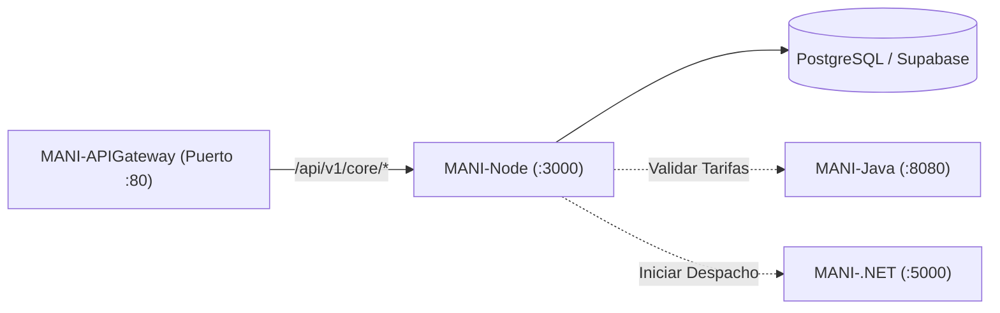

# MANI-Node — Servicio Core Backend de MANI

Servicio backend central y transaccional del ecosistema **MANI** (*TRAMA · Ingeniería de Software*), desarrollado en **Node.js y Express**.

Este repositorio es responsable del dominio operativo principal: gestión de usuarios, roles (Clientes, Aliados y Administradores), validación de documentación KYC, catálogo de servicios, aislamiento multi-tenant y persistencia en la base de datos principal (PostgreSQL / Supabase).

---

## 🏛️ Rol en la Arquitectura SOA (ADR-0019)

Dentro del ecosistema distribuido de MANI, **`MANI-Node`** opera como el núcleo de negocio:

* **Puerto Interno:** `3000`
* **Exposición Externa:** Vía **`MANI-APIGateway`** bajo el prefijo `/api/v1/core/*`.
* **Persistencia:** Administrador primario de las tablas operacionales en PostgreSQL (Supabase) bajo políticas de Row-Level Security (RLS).
* **Interacción con otros servicios:**
  - Consume reglas y tarifarios de **`MANI-Java`** (`http://rules-service:8080`).
  - Coordina estados de despacho con **`MANI-.NET`** (`http://dispatch-service:5000`).
  - No recibe peticiones directas de los clientes frontend; todo el tráfico ingresa filtrado por el API Gateway.



---

## 🚀 Endpoints Principales

| Método | Ruta en Gateway | Descripción | Auth Requerida |
| :--- | :--- | :--- | :---: |
| `GET` | `/api/v1/core/health` | Estado del servicio y tiempo de actividad. | No |
| `GET` | `/api/v1/core/tenants` | Catálogo de empresas / tenants activos. | Sí |
| `GET` | `/api/v1/core/profiles/me` | Información del perfil del usuario autenticado. | Sí (JWT) |
| `GET` | `/api/v1/core/catalog` | Catálogo de servicios de manicura disponibles. | No |

### Ejemplo de Respuesta (`GET /api/v1/core/health`):
```json
{
  "status": "UP",
  "service": "MANI-Node",
  "timestamp": "2026-10-05T19:50:00Z",
  "correlationId": "c9a4b2a8-1234-5678-90ab-cdef12345678"
}
```

---

## 🛠️ Stack Tecnológico

* **Runtime:** Node.js (v20+ LTS).
* **Framework Web:** Express 4.x.
* **Seguridad & Middleware:** CORS, Dotenv, Parser JSON nativo.
* **Contenerización:** Docker (imagen base `node:20-alpine`).

---

## ⚙️ Configuración y Variables de Entorno

Copia el archivo de variables de entorno base:
```bash
cp .env.example .env
```

| Variable | Descripción | Valor por Defecto |
| :--- | :--- | :--- |
| `PORT` | Puerto de escucha HTTP del servicio | `3000` |
| `NODE_ENV` | Entorno de ejecución (`development`, `production`) | `development` |
| `SUPABASE_URL` | Endpoint del proyecto de Supabase | `https://your-project.supabase.co` |
| `SUPABASE_SERVICE_ROLE_KEY` | Llave de servicio para operaciones seguras de backend | *Secreto* |
| `RULES_SERVICE_URL` | URL interna del motor de reglas Java | `http://rules-service:8080` |
| `DISPATCH_SERVICE_URL`| URL interna del servicio de despacho .NET | `http://dispatch-service:5000` |

---

## 💻 Ejecución Local

### Opción 1: Con Node.js local
```bash
# Instalar dependencias
npm install

# Modo desarrollo con auto-reload
npm run dev

# Modo producción
npm start
```

### Opción 2: Con Docker
```bash
# Construir imagen
docker build -t mani-node:local .

# Ejecutar contenedor
docker run -d -p 3000:3000 --name mani-core mani-node:local
```

---

## 👥 Equipo y Gobernanza
* **Organización:** [TRAMA · Ingeniería de Software](https://github.com/Trama-AS)
* **Repositorio Oficial:** [MANI-Node](https://github.com/Trama-AS/MANI-Node)
