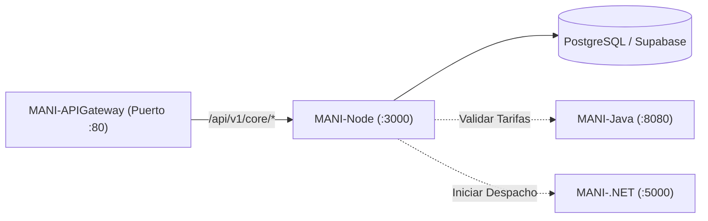

# MANI-Node — Servicio Core Backend de MANI

Servicio backend central y transaccional del ecosistema **MANI** (*TRAMA · Ingeniería de Software*), desarrollado en **Node.js y Express**.

Este repositorio es responsable del dominio operativo principal: gestión de usuarios, roles (Clientes, Aliados y Administradores), validación de documentación KYC, catálogo de servicios, aislamiento multi-tenant y persistencia en la base de datos principal (PostgreSQL / Supabase).

---

## 🏛️ Rol en la Arquitectura SOA (ADR-0019)

Dentro del ecosistema distribuido de MANI, **`MANI-Node`** opera como el núcleo de negocio:

* **Puerto Interno:** `3000`
* **Exposición Externa:** Vía **`MANI-APIGateway`** bajo el prefijo `/api/v1/core/*`.
* **Persistencia:** Administrador primario de las tablas operacionales en PostgreSQL (Supabase) bajo políticas de Row-Level Security (RLS).
* **Interacción con otros servicios:**
  - Consume reglas y tarifarios de **`MANI-Java`** (`http://rules-service:8080`).
  - Coordina estados de despacho con **`MANI-.NET`** (`http://dispatch-service:5000`).
  - No recibe peticiones directas de los clientes frontend; todo el tráfico ingresa filtrado por el API Gateway.



---

## 🚀 Endpoints Principales

| Método | Ruta en Gateway | Descripción | Auth Requerida |
| :--- | :--- | :--- | :---: |
| `GET` | `/api/v1/core/health` | Estado del servicio y tiempo de actividad. | No |
| `GET` | `/api/v1/core/tenants` | Catálogo de empresas / tenants activos. | Sí |
| `GET` | `/api/v1/core/profiles/me` | Información del perfil del usuario autenticado. | Sí (JWT) |
| `GET` | `/api/v1/core/catalog` | Catálogo de servicios de manicura disponibles. | No |

### Ejemplo de Respuesta (`GET /api/v1/core/health`):
```json
{
  "status": "UP",
  "service": "MANI-Node",
  "timestamp": "2026-10-05T19:50:00Z",
  "correlationId": "c9a4b2a8-1234-5678-90ab-cdef12345678"
}
```

---

## 🛠️ Stack Tecnológico

* **Runtime:** Node.js (v20+ LTS).
* **Framework Web:** Express 4.x.
* **Seguridad & Middleware:** CORS, Dotenv, Parser JSON nativo.
* **Contenerización:** Docker (imagen base `node:20-alpine`).

---

## ⚙️ Configuración y Variables de Entorno

Copia el archivo de variables de entorno base:
```bash
cp .env.example .env
```

| Variable | Descripción | Valor por Defecto |
| :--- | :--- | :--- |
| `PORT` | Puerto de escucha HTTP del servicio | `3000` |
| `NODE_ENV` | Ambiente de ejecución: `development` (DEV), `qa` (QA), `production` (PROD) o `test` | `development` |
| `SUPABASE_URL` | Endpoint del proyecto de Supabase (requerido en `qa`/`production`) | `https://your-project.supabase.co` |
| `SUPABASE_SERVICE_ROLE_KEY` | Llave de servicio para operaciones seguras de backend (requerido en `qa`/`production`) | *Secreto* |
| `RULES_SERVICE_URL` | URL interna del motor de reglas Java | `http://rules-service:8080` |
| `DISPATCH_SERVICE_URL`| URL interna del servicio de despacho .NET | `http://dispatch-service:5000` |

`src/config/index.js` normaliza `NODE_ENV` y, al arrancar (`src/server.js`), ejecuta `assertValid()`: si falta alguna variable requerida por el ambiente actual (p. ej. `SUPABASE_URL` en `qa`), el proceso termina con un mensaje que indica el **nombre** de la variable faltante, nunca su valor. Ningún secreto vive en el código: todos se leen desde `process.env`.

### Conexión a Supabase (service-role)
`src/infrastructure/db/SupabaseClientFactory.js` crea el cliente de Supabase con `SUPABASE_URL` y `SUPABASE_SERVICE_ROLE_KEY` leídas desde `process.env` (vía `config`); si no están configuradas (p. ej. en DEV sin BD real), el cliente simplemente no se instancia y el core sigue operando con los repositorios en memoria. `SupabaseConnectionChecker` prueba la conexión llamando `auth.admin.listUsers`, un endpoint que solo responde con una service-role key válida (no con la anon key), por lo que confirma realmente que la credencial de servicio funciona.

### Health Check
`GET /health` no requiere autenticación, ejecuta la prueba de conexión a Supabase y responde:
```json
{
  "status": "UP",
  "service": "MANI-Core-Node",
  "environment": "DEV",
  "uptimeSeconds": 42,
  "timestamp": "2026-10-06T20:21:23.532Z",
  "database": { "configured": false, "connected": false },
  "correlationId": "node-1791318083531"
}
```
Si `SUPABASE_URL`/`SUPABASE_SERVICE_ROLE_KEY` están configuradas pero la conexión falla, `status` pasa a `DEGRADED` y el endpoint responde `503` con `database.error` indicando el motivo (sin exponer secretos). Si la conexión es exitosa, `database.connected` es `true` y se incluye `latencyMs`.

---

## 💻 Ejecución Local

### Opción 1: Con Node.js local
```bash
# Instalar dependencias
npm install

# Modo desarrollo con auto-reload
npm run dev

# Modo producción
npm start

# Linter
npm run lint

# Pruebas unitarias e integración
npm test
```

### Opción 2: Con Docker
```bash
# Construir imagen
docker build -t mani-node:local .

# Ejecutar contenedor
docker run -d -p 3000:3000 --name mani-core mani-node:local
```

---

## 🔄 CI/CD

* **CI** (`.github/workflows/ci.yml`): en cada push y PR corre `npm run lint` y `npm test`.
* **CD** (`.github/workflows/cd.yml`): en cada push a `main`, construye la imagen con el `Dockerfile` (`node:22-alpine`, requerido por `@supabase/supabase-js`) y la publica en GHCR como `ghcr.io/trama-as/mani-node:<sha>` y `:latest`. Luego despliega por SSH primero en **DEV** y, si el health check responde `200`, promueve el mismo artefacto a **QA**.
* También se puede disparar manualmente (`workflow_dispatch`) para redesplegar un tag de imagen existente sin reconstruir.

Infraestructura pendiente de aprovisionar (coordinar con **CFG-27/CFG-28**) antes de que el job de deploy funcione de punta a punta:
1. Hosts DEV y QA con Docker instalado, accesibles por SSH desde GitHub Actions runners.
2. GitHub Environments `dev` y `qa` (Settings → Environments), cada uno con estos secrets:
   `SSH_HOST`, `SSH_USER`, `SSH_KEY`, `SSH_PORT` (opcional), `HOST_PORT` (opcional), `SUPABASE_URL`, `SUPABASE_SERVICE_ROLE_KEY`, `HEALTHCHECK_URL` (ej. `http://<host>:<puerto>/health`).
3. (Recomendado) "Required reviewers" en el Environment `qa` para aprobar manualmente la promoción DEV → QA.

Hasta que esos secrets existan, el job `build-and-push` sí publicará la imagen en GHCR; los jobs `deploy-dev`/`deploy-qa` fallarán al no encontrar host/credenciales, lo cual es esperado hasta completar el aprovisionamiento.

---

## 👥 Equipo y Gobernanza
* **Organización:** [TRAMA · Ingeniería de Software](https://github.com/Trama-AS)
* **Repositorio Oficial:** [MANI-Node](https://github.com/Trama-AS/MANI-Node)
